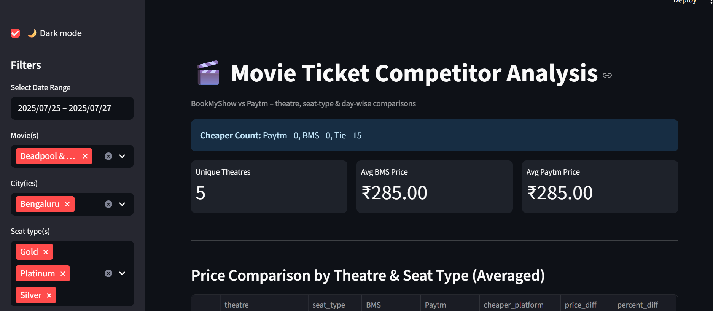

# 🎬 Movie Ticket Competitor Analysis Dashboard

An advanced **data analytics project** that compares **movie ticket prices** across platforms (BookMyShow vs Paytm), highlights **pricing trends**, detects **anomalies**, and forecasts future ticket prices.  
The project includes an interactive **Streamlit dashboard** and a **data pipeline with MLflow tracking** for experiments and forecasts.

---

## **Dashboard Preview**


---

## **Key Highlights**
- **Price Comparison & Analytics**: Identify which platform offers cheaper tickets for each city and movie.
- **Dynamic Dashboard**:
  - Filters by city, movie, and platform.
  - Visual insights using Plotly (bar charts, line trends, and pie charts).
  - Anomaly detection for sudden price changes.
- **Price Forecasting**:
  - Predicts ticket price trends using **Prophet** and **Linear Regression** models.
- **Experiment Tracking**:
  - Integrated **MLflow** for reproducibility and performance tracking.
- **Configurable Pipeline**:
  - YAML-based config for cities, movies, and platforms.

---

## **Price Trend Example**


---

## **Tech Stack**
- **Languages:** Python (pandas, NumPy, scikit-learn)
- **Visualization:** Streamlit, Plotly
- **Forecasting:** Prophet, Linear Regression
- **Experiment Tracking:** MLflow
- **Configuration:** YAML-driven pipeline

---

## **Project Structure**
```
movie_ticket_tracker/
│
├── config/
│   └── config.yaml
├── data/
│   ├── ticket_prices.csv        # Raw data
│   ├── analysis_summary.csv     # Analysis results
├── scripts/
│   ├── app.py                   # Streamlit dashboard
│   ├── analyze.py               # Data analysis script
│   ├── run_both.py              # Runs both scrapers and analysis
│   ├── scraper_bms.py           # Scraper for BookMyShow
│   ├── scraper_paytm.py         # Scraper for Paytm Movies
│       
├── Images/
│   ├── Dashboard.png
│   ├── price_trend.png
│   ├── BMS.png                  # BookMyShow data visualization
│   ├── Paytm_graph.png          # Paytm graph visualization
├── requirements.txt
└── README.md
```

---

## **Setup & Run**
1. **Clone the repository:**
   ```bash
   git clone https://github.com/<your-username>/movie-ticket-competitor-analysis.git
   cd movie-ticket-competitor-analysis
   ```

2. **Create and activate a virtual environment:**
   ```bash
   python -m venv venv
   venv\Scripts\activate  # For Windows
   ```

3. **Install dependencies:**
   ```bash
   pip install -r requirements.txt
   ```

4. **Run the Streamlit dashboard:**
   ```bash
   streamlit run scripts/app.py
   ```

---

## **Use Cases**
- **Competitive Analysis**: Compare movie ticket pricing strategies across platforms.
- **Forecasting**: Predict future price changes to make better decisions.
- **Anomaly Alerts**: Identify unusual price spikes or discounts.

---

## **Future Enhancements**
- Deploy the dashboard on **Streamlit Cloud** or **Heroku**.
- Add **real-time scraping** for continuous price tracking.
- Expand to more platforms and cities.
- Integrate alerts (Slack/Email) for price anomalies.

---

## **Author**
Developed by *[Khushi Sharma]* 🚀
